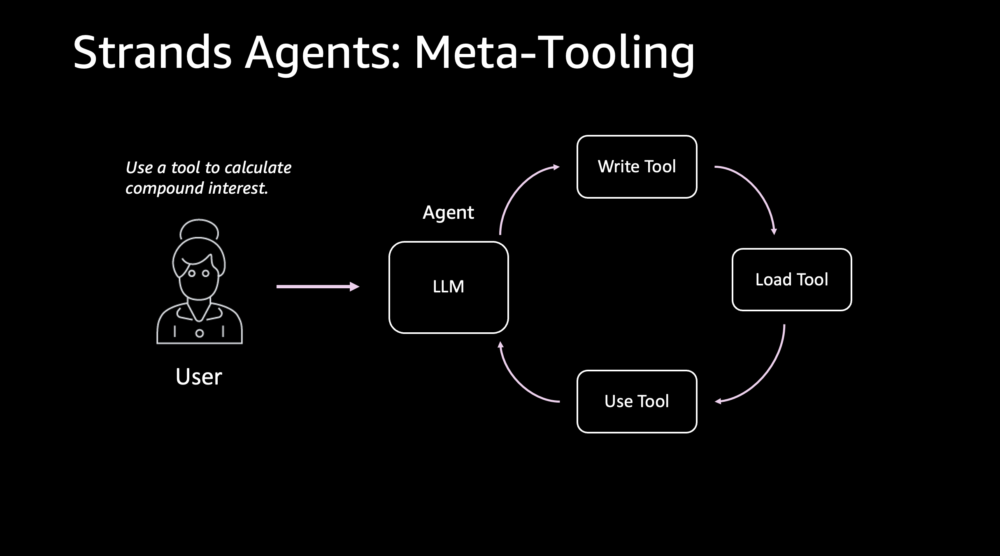

# strands-agents-meta-tooling
This is an example of a [strands agent](https://strandsagents.com/latest/documentation/docs/examples/python/meta_tooling/) that can create and load its own tools in the same runtime.

## What is Meta-Tooling?

Meta-tooling allows AI agents to dynamically extend their own capabilities by:
- **Writing new Python functions** based on natural language descriptions
- **Testing the code** they create to ensure it works correctly
- **Immediately using** the new tools without restarting
- **Debugging and fixing** issues in their own code

## Architecture



The self-extending agent follows this flow:
1. **User Request** → Agent receives a natural language request for a new tool
2. **Tool Creation** → Agent uses `editor` tool to write Python code with `@tool` decorator
3. **Test Generation** → Agent creates comprehensive pytest tests for validation
4. **Test Execution** → Agent uses `shell` tool to run tests and verify functionality
5. **Hot Reload** → Agent dynamically loads the new tool via `load_tools_from_directory`
6. **Tool Usage** → Agent immediately uses the created tool to solve the problem
7. **Result** → Agent returns the solution to the user

## Use Cases

This demo showcases several practical applications:

1. **Rapid Prototyping**: Quickly create utility functions without manual coding
2. **Adaptive Problem Solving**: Agent creates specialized tools for unique tasks on-the-fly
3. **Automated Testing**: Agent writes and runs comprehensive test suites for reliability
4. **Learning Systems**: Foundation for agents that expand their capabilities over time
5. **Custom Workflows**: Build domain-specific tools tailored to your specific needs

## Getting Started

To run this example:

1. Clone this repository:
```bash
git clone https://github.com/labeveryday/strands-agents-meta-tooling
cd strands-agents-meta-tooling
```

2. Install the required dependencies:
```bash
pip install -r requirements.txt
```

3. Create a `.env` file with your Anthropic API key:
```
ANTHROPIC_API_KEY=your_api_key_here
```

4. Run one of the examples:
```bash
# Run the interactive command-line example
python self_extending_agent.py

# Or open the Jupyter notebook example
jupyter notebook self_extending_notebook.ipynb
```

**Note**: The `tools/` directory is already created in this repository. This is where the agent will generate new Python tools during runtime and is required.

## Example Output

When you run the demo, the agent will:
1. Create a `tools/add_numbers.py` file with a function to add two numbers
2. Create a `tools/calculate_compound_interest.py` for financial calculations
3. Create a `tools/analyze_text.py` for text statistics
4. Write comprehensive pytest tests in `tools/tests/`
5. Run the tests to verify everything works
6. Use the tools to solve the problems you specify

## Learn More

- 📚 [Strands Agents Meta-Tooling Documentation](https://strandsagents.com/latest/documentation/docs/examples/python/meta_tooling/) - Official documentation for meta-tooling with Strands

## Connect

Connect with me, Du'An Lightfoot:
[LinkedIn](https://www.linkedin.com/in/duanlightfoot/)
